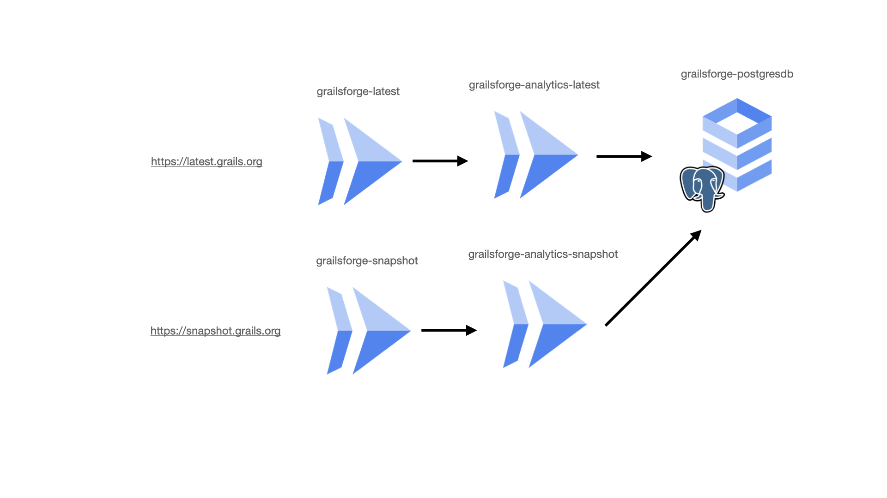
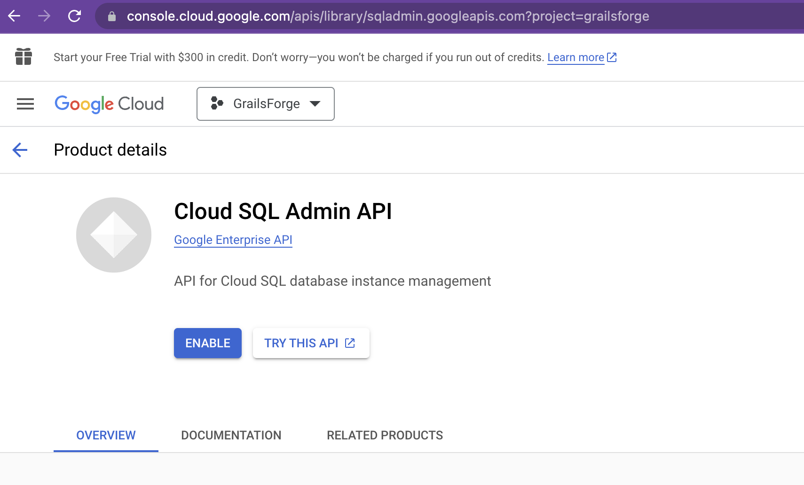
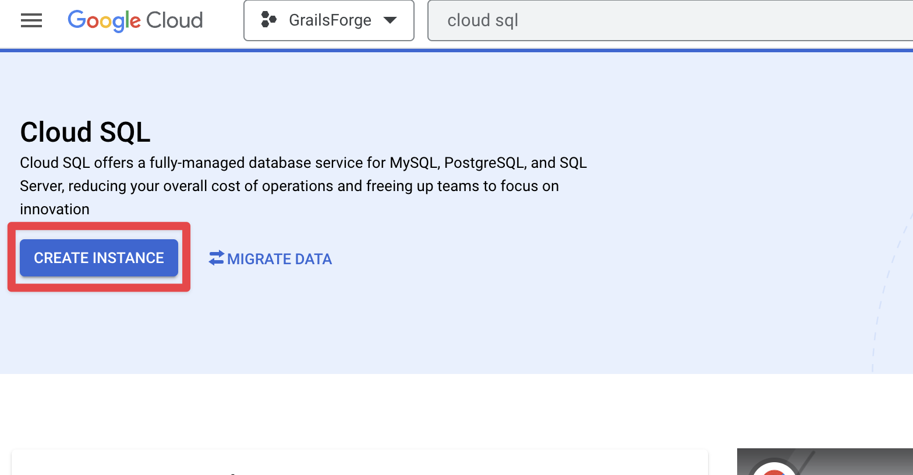
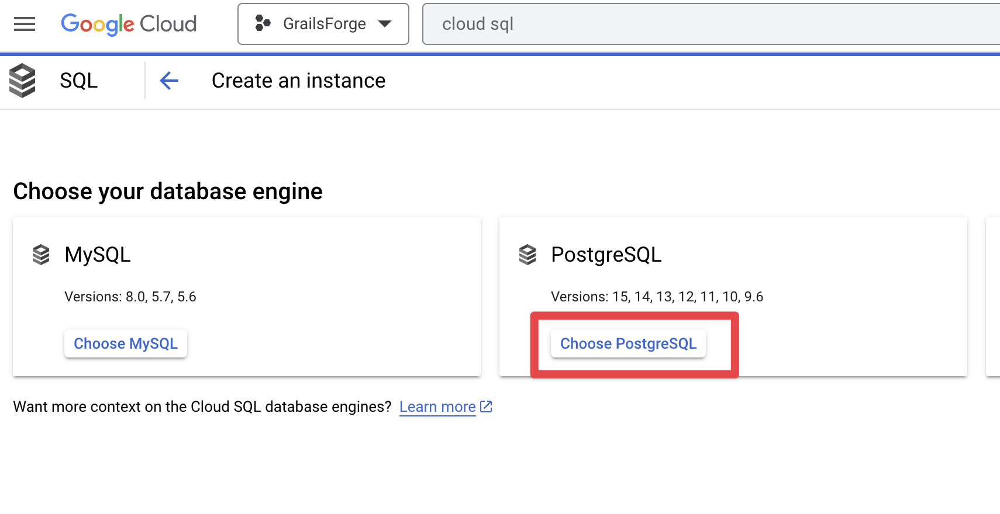
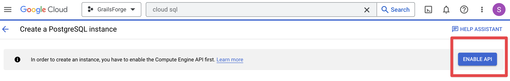
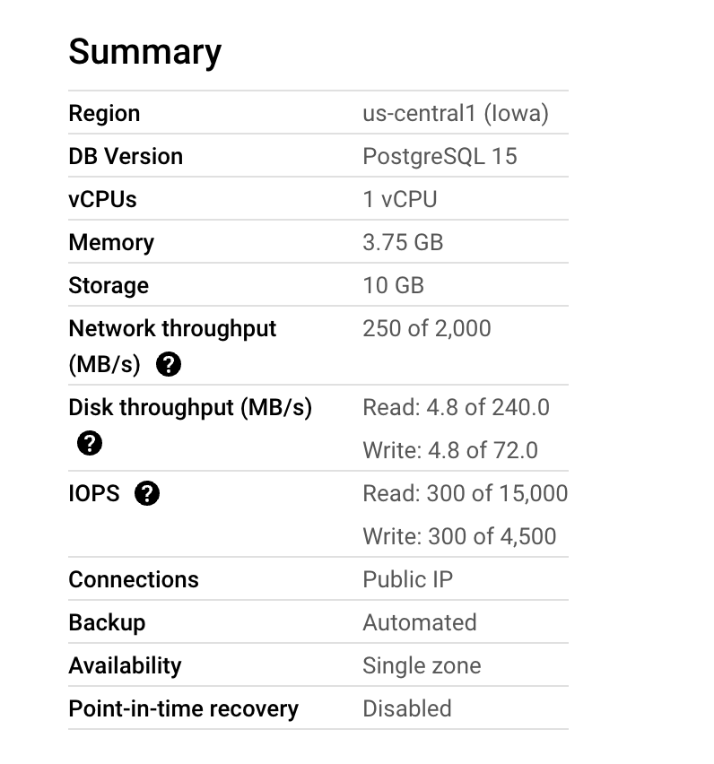
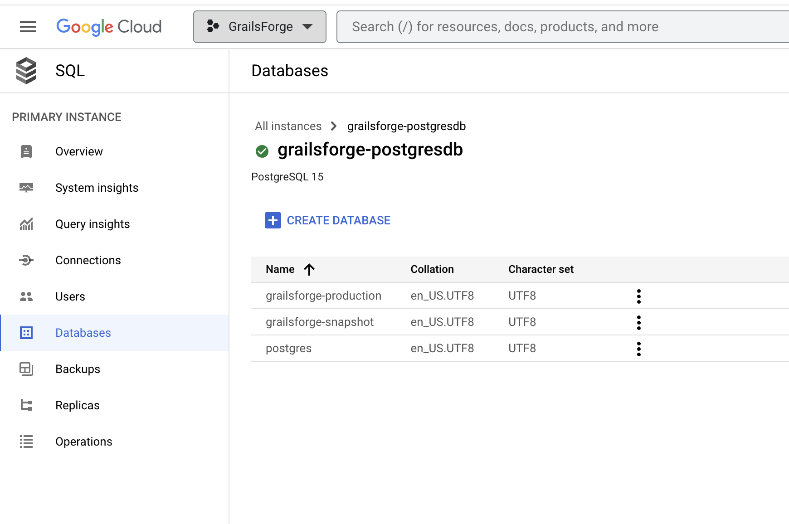

# Grails Application Forge

[](https://search.maven.org/artifact/org.grails.forge/grails-forge-core)
[](https://github.com/grails/grails-forge/actions)
[](https://ge.grails.org/scans)

Generates Grails applications.

## Installation

The CLI application comes in various flavours from a universal Java applications to native applications for Windows, Linux and OS X. These are available for direct download on the [releases page](https://github.com/grails/grails-forge/releases). For installation see the [Grails documentation](https://docs.grails.org/latest/guide/index.html#buildCLI).

If you prefer not to install an application to create Micronaut applications you can do so with `curl` directly from the API:

```bash
$ curl --location --request GET 'https://grailsforge-latest-cjmq3uyfcq-uc.a.run.app/create/web/com.example.demo?gorm=HIBERNATE&servlet=TOMCAT&test=SPOCK&javaVersion=JDK_11' --output demo.zip
$ unzip demo.zip -d demo
$ cd demo
$ ./gradlew run
```

Run `curl https://forge.grails.org` for more information on how to use the API or see the API documentation referenced below.

## UI

If you prefer a browser based user interface you can visit [Grails Forge](https://start.grails.org).

The user interface is [written in React](https://github.com/grails/grails-forge-ui/tree/main/app/launch) and is a static single page application that simply interacts with the https://start.grails.org API.

## API

API documentation for the production instance can be found at:

* [Swagger / OpenAPI Doc](https://start.grails.org/swagger/views/swagger-ui/index.html)
* [RAPI Doc](https://start.grails.org/swagger/views/rapidoc/index.html)

API documentation for the snapshot /development instance can be found at:

* [Swagger / OpenAPI Doc](https://snapshot.grails.org/swagger/views/swagger-ui/index.html)
* [RAPI Doc](https://snapshot.grails.org/swagger/views/rapidoc/index.html)

## Documentation

<!-- See the [Documentation](https://grails.github.io/grails-forge/6.0.x/guide/) for more information. -->

See the [Snapshot Documentation](https://grails.github.io/grails-forge/snapshot/guide/) for the current development docs.

## Snapshots and Releases

Snapshots are automatically published to [Sonatype OSSRH](https://s01.oss.sonatype.org/content/repositories/snapshots/) using [Github Actions](https://github.com/grails/grails-forge/actions).

See the documentation in the [Grails Docs](https://docs.grails.org/latest/guide/index.html#usingsnapshots) for how to configure your build to use snapshots.

Releases are published to Maven Central via [Github Actions](https://github.com/grails/grails-forge/actions).

A release is performed with the following steps:

* [Publish the draft release](https://github.com/grails/grails-forge/releases). There should be already a draft release created, edit and publish it. The Git Tag should start with `v`. For example `v1.0.0`.
* [Monitor the Workflow](https://github.com/grails/grails-forge/actions?query=workflow%3ARelease) to check it passed successfully.
* Celebrate!

## Architecture



## Distribution to Google Cloud Run via GitHub Actions


### Cloud Run

To make your life easier, export these environment variables so that you can copy and paste the commands used here. Choose whatever name you want, but the $PROJECT_ID has to be a unique name, because project IDs can't be reused in Google Cloud.

```
export PROJECT_ID=
export ACCOUNT_NAME=
```

For example, your commands should look something like this:

```
export PROJECT_ID=grailsforge
export ACCOUNT_NAME=grailsforge
```

Log in with your Google account:

```
gcloud auth login
```

```
gcloud projects create $PROJECT_ID
gcloud config set project $PROJECT_ID
```

Enable billing for your project, and create a billing profile if you don’t have one:

```
open "https://console.cloud.google.com/billing/linkedaccount?project=$PROJECT_ID"
```

Enable the necessary services:

```
gcloud services enable cloudbuild.googleapis.com run.googleapis.com containerregistry.googleapis.com
```

Create a service account:

```
gcloud iam service-accounts create $ACCOUNT_NAME \
--description="Cloud Run deploy account" \
--display-name="Cloud-Run-Deploy"
Give the service account Cloud Run Admin, Storage Admin, and Service Account User roles. You can’t set all of them at once, so you have to run separate commands:


gcloud projects add-iam-policy-binding $PROJECT_ID \
--member=serviceAccount:$ACCOUNT_NAME@$PROJECT_ID.iam.gserviceaccount.com \
--role=roles/run.admin

gcloud projects add-iam-policy-binding $PROJECT_ID \
--member=serviceAccount:$ACCOUNT_NAME@$PROJECT_ID.iam.gserviceaccount.com \
--role=roles/storage.admin

gcloud projects add-iam-policy-binding $PROJECT_ID \
--member=serviceAccount:$ACCOUNT_NAME@$PROJECT_ID.iam.gserviceaccount.com \
--role=roles/iam.serviceAccountUser

gcloud projects add-iam-policy-binding $PROJECT_ID \
--member=serviceAccount:$ACCOUNT_NAME@$PROJECT_ID.iam.gserviceaccount.com \
--role=roles/artifactregistry.writer
```

Generate a key.json file with your credentials, so your GitHub workflow can authenticate with Google Cloud:

```
gcloud iam service-accounts keys create key.json \
--iam-account $ACCOUNT_NAME@$PROJECT_ID.iam.gserviceaccount.com
```

### GitHub Actions

GitHub, you need to set up a secrets environment in your repository, with the following values:

- `GCP_PROJECT_ID` is your `$PROJECT_ID`.
- `GCP_APP_NAME` is your app name.
- `GCP_EMAIL` is the email from the service account you created, which should look like this: `$ACCOUNT_NAME@$PROJECT_ID.iam.gserviceaccount.com`
- `GCP_CREDENTIALS` is the content from the key.json file that you just created.
- 
For example, your settings should look something like this:

`GCP_PROJECT_ID = grailsforge`  
`GCP_APP_NAME = grailsforge`  
`GCP_EMAIL = account-name@project-example.iam.gserviceaccount.com`    

Cat the `key.json` content and paste it into the `GCP_CREDENTIALS` secret value.

Now you just need to create a YAML file telling which commands your workflow should run. In your project directory, create a folder called `.github` and create another one inside it called `workflows`.

See the workflows in this project for examples.

## Cloud SQL Setup



### Cloud SQL Instance

Create an instance of Cloud SQL:



Choose PostgreSQL as your database engine: 





Configure it with the following options: 



### Databases

Create two databases `grailsforge-production` and `grailsforge-snapshot`



## Cloud Run environment variables

### Latest Env

#### Cloud Run grailsforge-latest

| Name                                             | Value                                                                                                                                  | 
|:-------------------------------------------------|:---------------------------------------------------------------------------------------------------------------------------------------|
| `MICRONAUT_ENV_DEDUCTION`                        | `false`                                                                                                                                |
| `MICRONAUT_ENVIRONMENTS`                         | `gcp`                                                                                                                                  |
| `MICRONAUT_HTTP_SERVICES_ANALYTICS_READ_TIMEOUT` | `20s`                                                                                                                                  |
| `MICRONAUT_HTTP_SERVICES_ANALYTICS_URL`          | URL of cloud run `grailsforge-analytics-latest`                                                                                        |
| `GITHUB_OAUTH_APP_CLIENT_ID`                     | The Client ID shared after creating GitHub OAuth App                                                                                   |
| `GITHUB_OAUTH_APP_CLIENT_SECRET`                 | The Client secret shared after creating the GitHub OAuth app                                                                           |
| `GITHUB_USER_AGENT`                              | URL of the grails-forge-ui static website. For example, `https://start.grails.org/`. The default value is `https://start.grails.org/`. |
| `GITHUB_REDIRECT_URL`                            | URL of the grails-forge-ui static website. For example, `https://start.grails.org/`. The default value is `https://start.grails.org/`. |

### Cloud Run grailsforge-analytics-latest

| Name                           | Value                                            | 
|:-------------------------------|:-------------------------------------------------|
| `CLOUD_SQL_CONNECTION_NAME`    | `grailsforge:us-central1:grailsforge-postgresdb` |
| `DB_NAME`                      | `grailsforge-production`                         |
| `MICRONAUT_ENV_DEDUCTION`      | `false`                                          |
| `MICRONAUT_ENVIRONMENTS`       | `gcp`                                            |
| `DATASOURCES_DEFAULT_USERNAME` | `***`                                            |
| `DATASOURCES_DEFAULT_PASSWORD` | `***`                                            |
| `DATASOURCES_DEFAULT_URL`      | `jdbc:postgresql:///grailsforge-production`      |


### Snapshot Env

### Cloud Run grailsforge-snapshot

| Name                                             | Value                                                                                                                                                  | 
|:-------------------------------------------------|:-------------------------------------------------------------------------------------------------------------------------------------------------------|
| `MICRONAUT_ENV_DEDUCTION`                        | `false`                                                                                                                                                |
| `MICRONAUT_ENVIRONMENTS`                         | `gcp`                                                                                                                                                  |
| `MICRONAUT_HTTP_SERVICES_ANALYTICS_READ_TIMEOUT` | `20s`                                                                                                                                                  |
| `MICRONAUT_HTTP_SERVICES_ANALYTICS_URL`          | URL of cloud run `grailsforge-analytics-snapshot`                                                                                                      |
| `GITHUB_OAUTH_APP_CLIENT_ID`                     | The Client ID shared after creating GitHub OAuth App                                                                                                   |
| `GITHUB_OAUTH_APP_CLIENT_SECRET`                 | The Client secret shared after creating the GitHub OAuth app                                                                                           |
| `GITHUB_USER_AGENT`                              | URL of the grails-forge-ui static website. For example, `https://start.grails.org/`. The default value is `https://grails.github.io/grails-forge-ui/`. |
| `GITHUB_REDIRECT_URL`                            | URL of the grails-forge-ui static website. For example, `https://start.grails.org/`. The default value is `https://grails.github.io/grails-forge-ui/`. |


### Cloud Run grailsforge-analytics-latest

| Name                           | Value                                            | 
|:-------------------------------|:-------------------------------------------------|
| `CLOUD_SQL_CONNECTION_NAME`    | `grailsforge:us-central1:grailsforge-postgresdb` |
| `DB_NAME`                      | `grailsforge-snapshot`                           |
| `MICRONAUT_ENV_DEDUCTION`      | `false`                                          |
| `MICRONAUT_ENVIRONMENTS`       | `gcp`                                            |
| `DATASOURCES_DEFAULT_USERNAME` | `***`                                            |
| `DATASOURCES_DEFAULT_PASSWORD` | `***`                                            |
| `DATASOURCES_DEFAULT_URL`      | `jdbc:postgresql:///grailsforge-snapshot`        |


